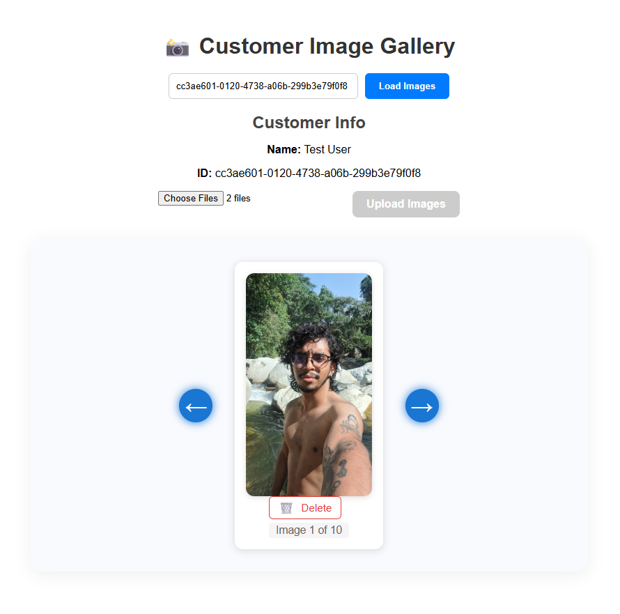

## Image Loader API

this a test for the api. So it does a Crud funtions.

In order to make ligther the development, the images are stored in memory as base64 strings. and in the cosole there is a test customer.

like this:

`Seeded customer: Test User, ID: 74c31ce2-d7f9-412e-8cec-73fd9bfa20c2`

### Stack

- .net 9
- Angular CLI: 20.3.1

## Run the projects

Angular:
cd "c:\Users\jacks\Github Repos\Image-Loader\customer-lead-app"
npx ng serve --open

.net:
dotnet run --project "c:\Users\jacks\Github Repos\Image-Loader\CustomerLeadApi"

Remenber to change the variable in the service

`private apiUrl = 'https://localhost:5001/api/customer';`

## Screenshots

